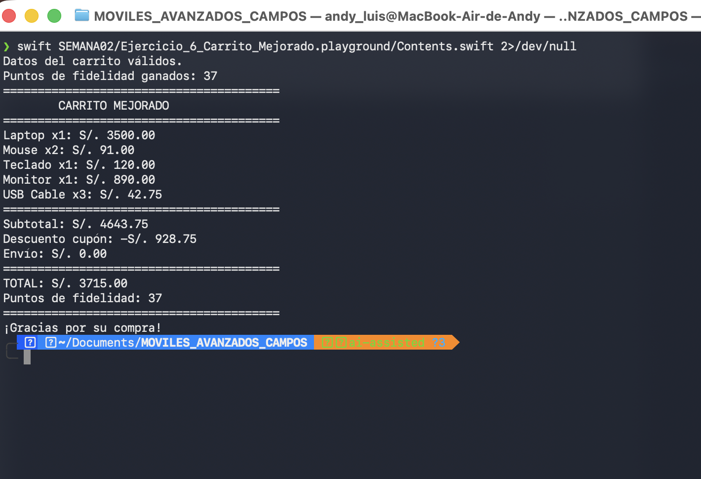
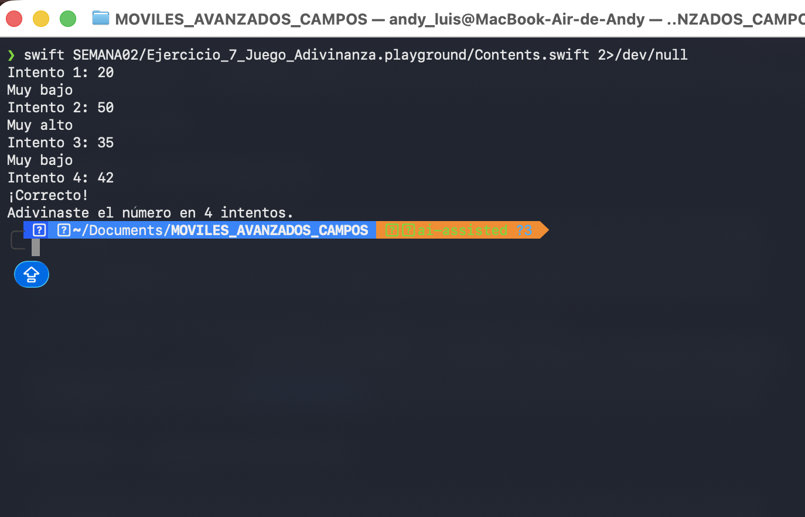

# Prompts utilizados con IA

## Laboratorio 02 - Programación en Móviles Avanzado

**Estudiante:** Andy Luis Campos Escandón  
**Docente:** Juan León S.  
**Rama:** `ai-assisted`  
**Lenguaje:** Swift  

---

# Ejercicio 6 - Carrito Mejorado con IA

Para desarrollar el carrito mejorado se utilizó IA como apoyo. El ejercicio se realizó por partes para poder revisar y comprender cada funcionalidad antes de continuar con la siguiente.

## Prompt 1 - Estructura inicial del carrito

Estoy desarrollando un carrito de compras en Swift usando un Playground de Xcode para el curso de Programación en Móviles Avanzado.

Ayúdame a crear la estructura inicial de un carrito de compras con 5 productos. Cada producto debe tener nombre, precio y cantidad.

Usa solamente conceptos básicos de Swift vistos hasta la Semana 2. No uses arrays, funciones, clases ni structs.

El código debe ser sencillo y entendible para un estudiante.

Comenta cada línea del código generado explicando específicamente qué hace.

---

## Prompt 2 - Validación de datos

Tengo un carrito de compras en Swift con 5 productos, cada uno con nombre, precio y cantidad.

Ayúdame a validar que ningún producto tenga un precio negativo y que ninguna cantidad sea igual a 0.

Si existe un dato inválido, muestra un mensaje de error. Si todos los datos son correctos, indica que el carrito es válido.

Usa solamente variables, condicionales y operadores lógicos básicos de Swift.

No uses arrays, funciones, clases ni structs.

Comenta cada línea nueva del código explicando específicamente qué hace.

---

## Prompt 3 - Descuento por cantidad

Tengo un carrito de compras en Swift donde cada producto tiene un precio y una cantidad.

Ayúdame a calcular el subtotal de cada producto y aplicar un descuento adicional del 5% cuando se compren 3 o más unidades del mismo producto.

El descuento debe aplicarse solamente al producto que cumpla la condición.

Usa variables, operaciones matemáticas y condicionales `if`.

No uses arrays, funciones, clases ni structs.

Mantén el código sencillo y comenta cada línea nueva explicando específicamente qué hace.

---

## Prompt 4 - Cupón de descuento

Ahora quiero agregar un cupón de descuento a mi carrito de compras en Swift.

Crea una variable que almacene el cupón `"DESCUENTO20"`.

Si el cupón coincide con `"DESCUENTO20"`, aplica un descuento adicional del 20% sobre el subtotal general de la compra. Si no coincide, el descuento debe permanecer en cero.

Usa solamente variables y condicionales `if`.

No uses arrays, funciones, clases ni structs.

Mantén el código sencillo y comenta cada línea nueva explicando específicamente qué hace.

---

## Prompt 5 - Costo de envío

Quiero agregar el costo de envío a mi carrito de compras en Swift.

Si el total después de aplicar el cupón supera S/. 3000, el envío debe ser gratis.

Si el total es S/. 3000 o menos, el costo de envío debe ser S/. 25.00.

Usa una variable para el costo del envío y una estructura `if`.

No uses arrays, funciones, clases ni structs.

Comenta cada línea nueva del código explicando específicamente qué hace.

---

## Prompt 6 - Puntos de fidelidad

Quiero agregar un sistema de puntos de fidelidad a mi carrito de compras en Swift.

El cliente debe obtener 1 punto por cada S/. 100 del total de la compra.

Los puntos deben mostrarse como un número entero.

Usa conceptos básicos de Swift y realiza la conversión de tipo necesaria.

No uses arrays, funciones, clases ni structs.

Comenta cada línea nueva del código explicando específicamente qué hace.

---

## Prompt 7 - Ticket final

Ya tengo implementado en mi carrito de compras en Swift el descuento por cantidad, el cupón de descuento, el costo de envío, los puntos de fidelidad y la validación de datos.

Ayúdame a mostrar un ticket final ordenado que incluya:

- Los 5 productos y sus cantidades.
- El subtotal.
- El descuento del cupón.
- El costo de envío.
- El total final.
- Los puntos de fidelidad obtenidos.

Los montos deben mostrarse con dos decimales.

Usa `print`, interpolación de cadenas y `String(format:)`.

No uses arrays, funciones, clases ni structs.

Comenta cada línea nueva del código explicando específicamente qué hace.

---

# Ejercicio 7 - Juego de Adivinanza con IA

Para desarrollar el juego de adivinanza se utilizó IA como apoyo, construyendo primero los datos del juego y posteriormente la lógica del bucle, las comparaciones y el mensaje final.

## Prompt 1 - Estructura inicial del juego

Estoy desarrollando un juego de adivinanza en Swift usando un Playground de Xcode para el curso de Programación en Móviles Avanzado.

Ayúdame a crear la estructura inicial del juego.

Debe existir un número secreto fijo entre 1 y 100 y cinco intentos simulados mediante variables individuales.

No debe existir entrada por teclado.

Usa solamente conceptos básicos de Swift vistos hasta la Semana 2.

No uses arrays, funciones, clases ni structs.

El código debe ser sencillo y entendible para un estudiante.

Comenta cada línea del código generado explicando específicamente qué hace.

---

## Prompt 2 - Bucle while y variables de control

Tengo un número secreto y cinco intentos simulados mediante variables en Swift.

Ayúdame a crear las variables de control necesarias y un bucle `while`.

El juego debe continuar mientras el jugador no haya adivinado y todavía tenga un máximo de 5 intentos disponibles.

Usa solamente variables, operadores lógicos y un bucle `while`.

No uses arrays, funciones, clases ni structs.

Comenta cada línea nueva del código explicando específicamente qué hace.

---

## Prompt 3 - Comparación del intento

Quiero comparar cada intento de mi juego de adivinanza con el número secreto.

Si el intento es mayor que el número secreto, debe mostrar `"Muy alto"`.

Si el intento es menor que el número secreto, debe mostrar `"Muy bajo"`.

Si el intento es igual al número secreto, debe mostrar `"¡Correcto!"` y detener el juego.

Usa estructuras `if`, `else if` y `else`.

No uses arrays, funciones, clases ni structs.

Comenta cada línea nueva del código explicando específicamente qué hace.

---

## Prompt 4 - Pasar al siguiente intento

Tengo cinco intentos almacenados en variables individuales y un contador llamado `numeroIntento`.

Ayúdame a cambiar el valor del intento actual después de cada vuelta del `while`.

Utiliza el contador para seleccionar `intento2`, `intento3`, `intento4` o `intento5` según corresponda.

No uses arrays porque todavía no se han trabajado en el curso.

Usa solamente variables, `if`, `else if` y `while`.

Comenta cada línea nueva del código explicando específicamente qué hace.

---

## Prompt 5 - Mensaje final

Quiero terminar mi juego de adivinanza en Swift.

Si el jugador logra adivinar el número secreto, muestra un mensaje indicando en cuántos intentos lo consiguió.

Si después de los 5 intentos no logra adivinar, muestra un mensaje indicando que perdió y revela el número secreto.

Usa solamente condicionales y las variables que ya existen.

No uses arrays, funciones, clases ni structs.

Comenta cada línea nueva del código explicando específicamente qué hace.

---

# Evidencias de ejecución

## Ejercicio 6 - Carrito Mejorado

La siguiente evidencia muestra la ejecución del carrito mejorado con los descuentos, costo de envío, total final y puntos de fidelidad.

---

## Ejercicio 7 - Juego de Adivinanza

La siguiente evidencia muestra los intentos realizados hasta encontrar correctamente el número secreto.

---

## Resultado

Con ayuda de IA se desarrollaron los ejercicios 6 y 7 de forma progresiva. Los prompts permitieron implementar cada funcionalidad por separado y revisar la lógica utilizada antes de continuar con la siguiente parte.
