# SEMANA 02 - Programación Móvil Avanzado

En esta semana se realizaron ejercicios prácticos utilizando Swift, aplicando entrada de datos, operaciones matemáticas, condicionales y validaciones.

## 1. Laboratorio 02 - Suma de dos números

En este ejercicio desarrollé un programa que permite ingresar dos números y realizar la suma de ambos, mostrando el resultado final en consola.

### Evidencia

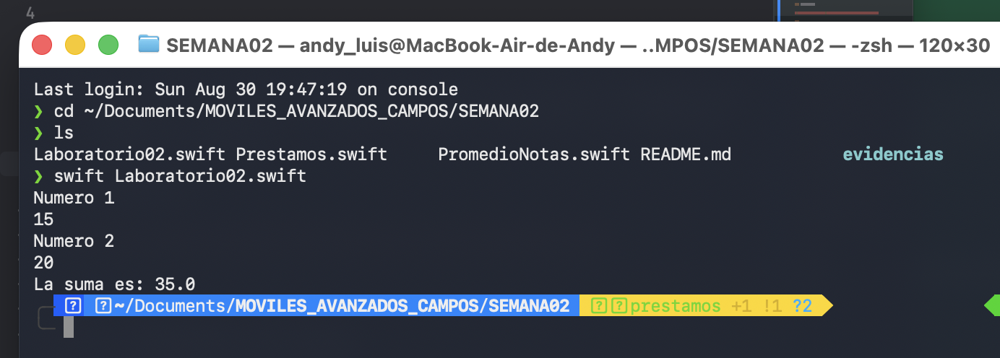

---

## 2. Promedio de Notas

En este ejercicio desarrollé un programa para calcular el promedio ponderado de un estudiante. Se consideran las notas del examen parcial, trabajo y examen final con sus respectivos porcentajes.

Los porcentajes utilizados son:

- Examen parcial: 30%
- Trabajo: 30%
- Examen final: 40%

El programa solicita las notas, realiza el cálculo y muestra el promedio final obtenido.

### Evidencia

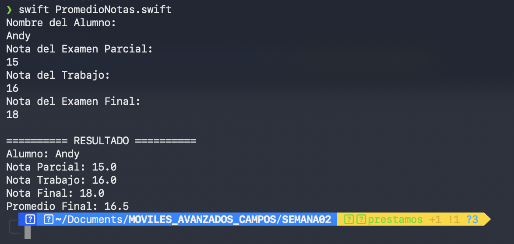

---

## 3. Sistema de Préstamo de Libros

En este ejercicio desarrollé un sistema de préstamo de libros en Swift. El programa permite registrar información del préstamo, identificar el tipo de usuario y trabajar con las fechas para determinar el estado final del préstamo.

También se aplicaron diferentes reglas y validaciones para controlar los días permitidos, atrasos, multas y la situación del usuario.

### Evidencia 1 - Préstamo permitido

En esta prueba se muestra un caso donde el usuario cumple con las condiciones establecidas y puede realizar el préstamo.

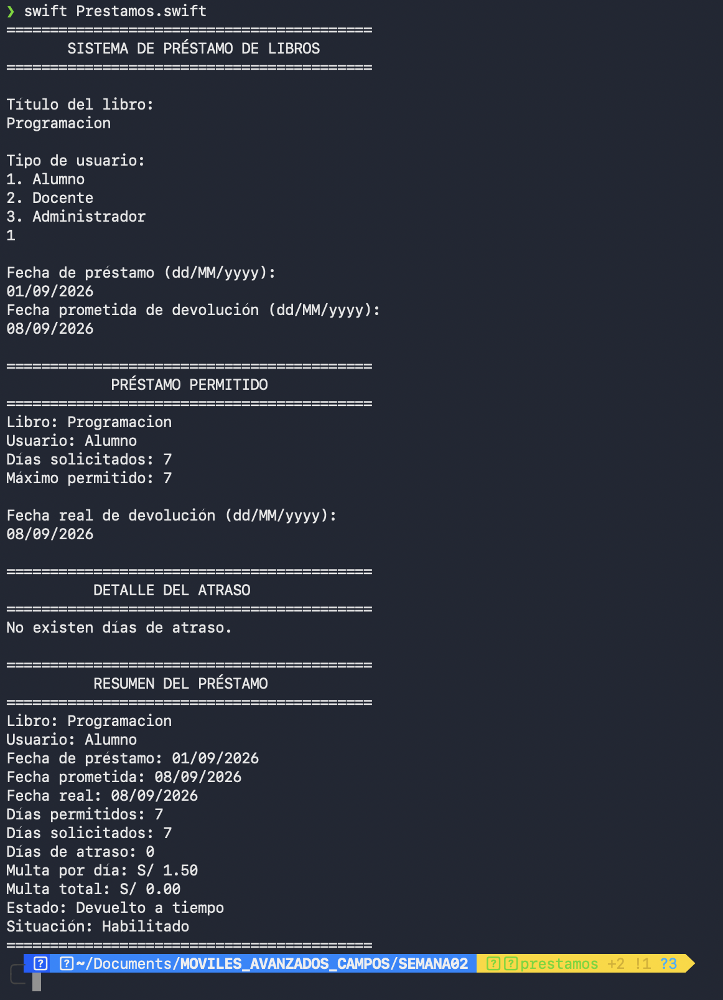

### Evidencia 2 - Devolución con atraso

En esta prueba se muestra un préstamo devuelto después de la fecha prometida. El programa calcula los días de atraso y la multa correspondiente.

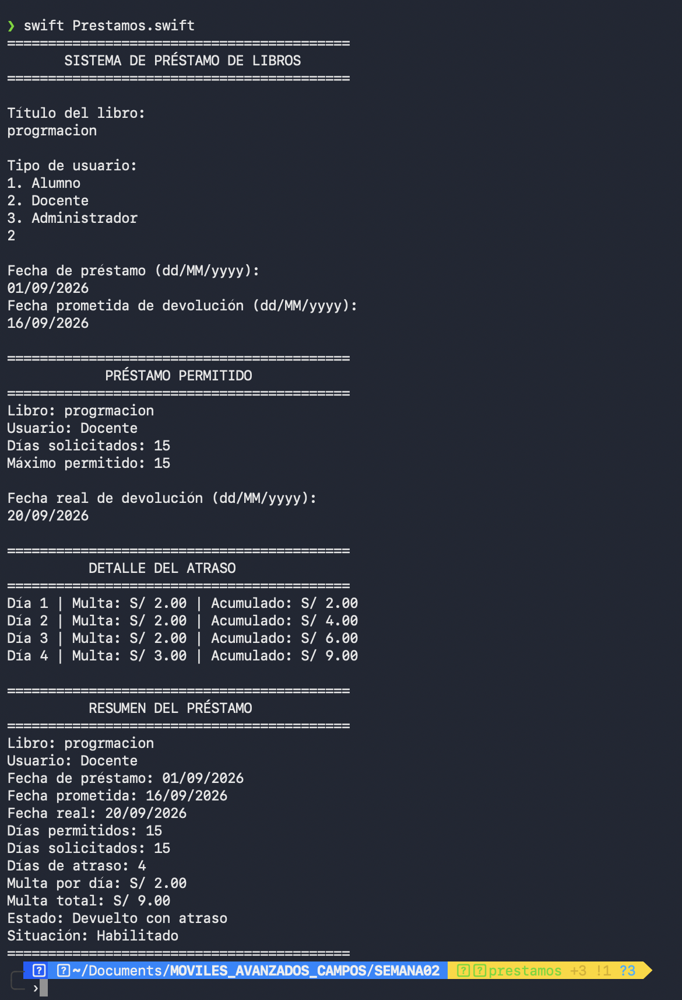

### Evidencia 3 - Usuario suspendido

En esta prueba se muestra el caso en el que el usuario alcanza la condición establecida para quedar suspendido.

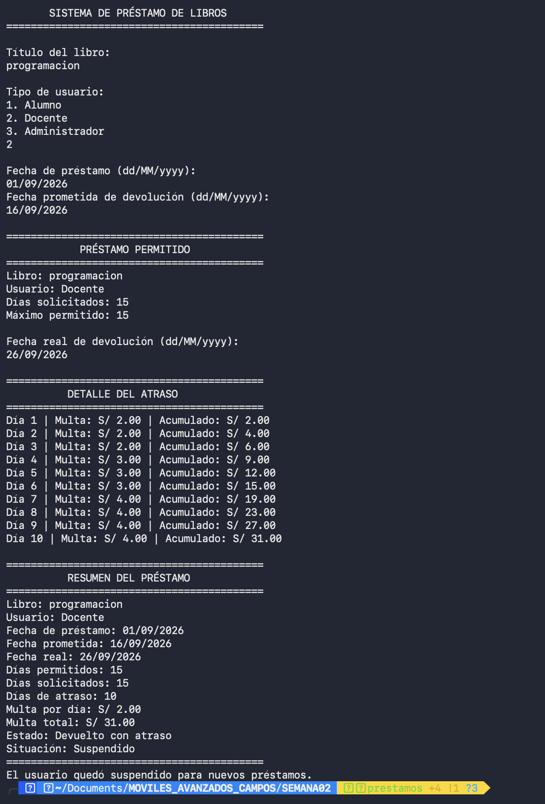

### Evidencia 4 - Préstamo no permitido

En esta prueba se comprueba que el sistema no permite continuar con el préstamo cuando se supera el límite establecido.

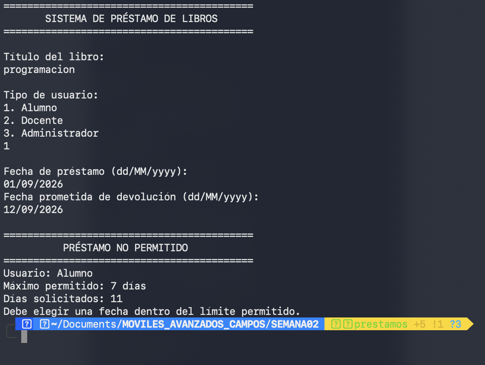

### Evidencia 5 - Validación de datos

En esta prueba se muestra una de las validaciones implementadas para evitar el ingreso de datos que no cumplen con las condiciones del sistema.

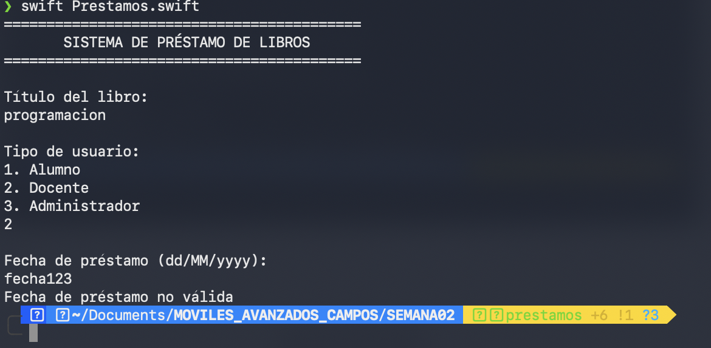

---

## 4. Actualización del Sistema de Préstamo

Se realizaron nuevas mejoras en el sistema de préstamo de libros. Se agregó el tipo de usuario Contador, se mejoraron las validaciones para el ingreso de datos y fechas, y se actualizaron las reglas para calcular las multas según los días de atraso. También se implementó la suspensión del usuario cuando alcanza los 20 días de atraso.

Para realizar estas mejoras utilicé inteligencia artificial como apoyo durante el desarrollo. El trabajo se realizó por partes, probando cada cambio antes de continuar con la siguiente funcionalidad.

### Prompt 1 - Agregar usuario Contador

Tengo un sistema de préstamo de libros en Swift que actualmente trabaja con los usuarios Alumno, Docente y Administrador. Quiero agregar un nuevo usuario llamado Contador, que tenga un máximo de 15 días de préstamo y una tarifa base de S/ 4.00. Mantén la estructura de mi código actual y no modifiques todavía las validaciones ni las reglas de multa.

### Evidencia - Usuario Contador

En esta prueba se muestra el nuevo usuario Contador funcionando dentro del sistema con un máximo de 15 días de préstamo y una tarifa base de S/ 4.00.

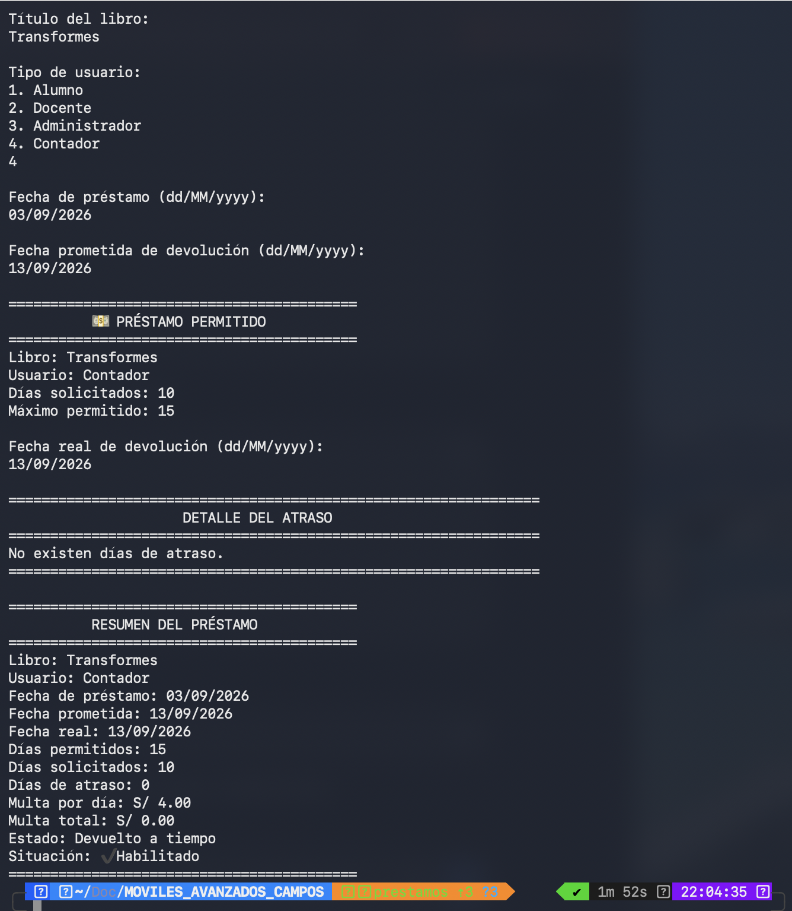

### Prompt 2 - Mejorar las validaciones

Ahora quiero mejorar las validaciones de mi sistema de préstamo. Si ingreso un tipo de usuario incorrecto, el programa debe volver a solicitarlo. La fecha de préstamo debe ser la fecha actual y, si ingreso una fecha inválida, debe volver a pedirla sin cerrar el programa. También valida que la fecha prometida no sea anterior al préstamo y que no supere el máximo de días permitido según el tipo de usuario.

### Evidencia - Nuevas validaciones

En esta prueba se comprueba que el programa detecta un dato incorrecto y vuelve a solicitar la información sin finalizar la ejecución.

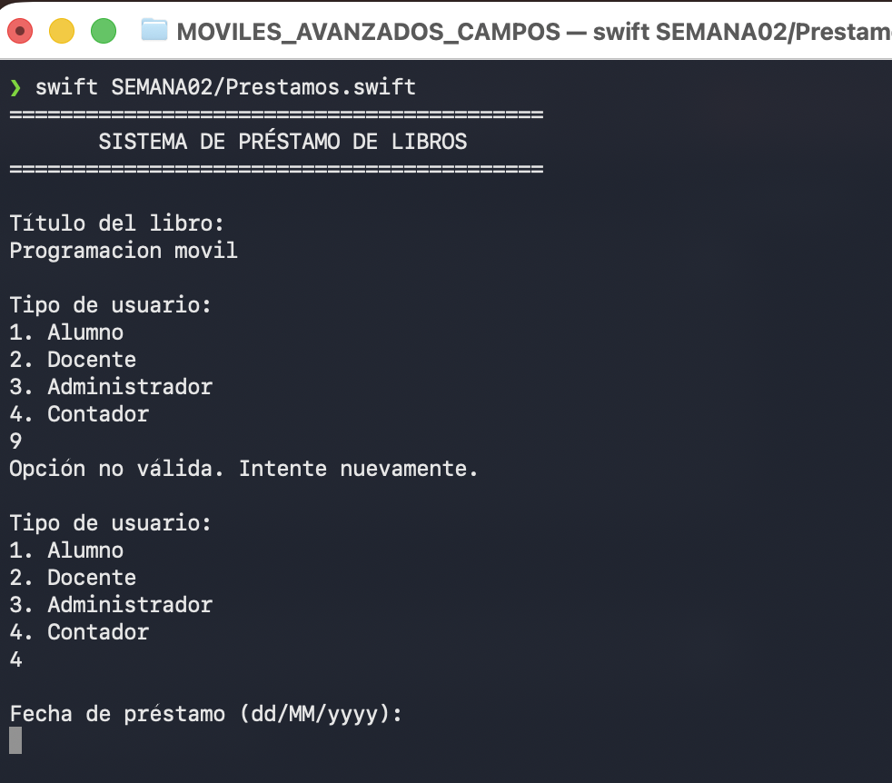

### Prompt 3 - Actualizar multas y suspensión

Ahora actualiza las reglas de multa de mi sistema. Los días 1 al 3 de atraso no deben tener multa, del día 4 al 6 se debe aplicar el 25% de la tarifa base, del día 7 al 10 el 50% y desde el día 11 el 100%. Si el usuario llega a 20 días de atraso o más debe quedar suspendido. También quiero que se muestre el detalle de cada día de atraso con su fecha, multa aplicada y monto acumulado, manteniendo la estructura y los iconos de mi código.

### Evidencia - Nuevas reglas de multa

En esta prueba se muestra el cálculo de las multas por tramos según los días de atraso, mostrando la fecha, la multa aplicada y el monto acumulado.

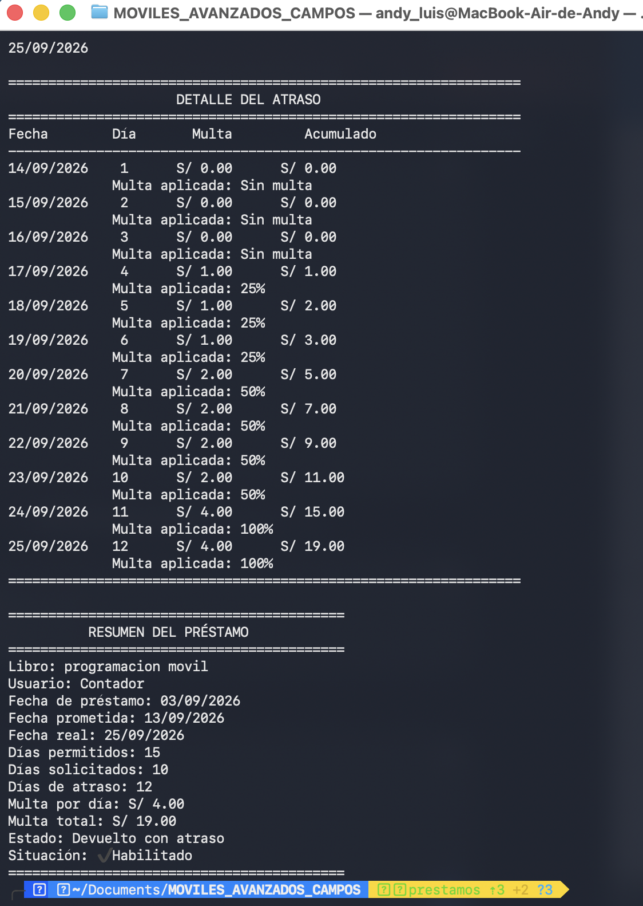

### Evidencia - Nueva suspensión

En esta prueba se comprueba que cuando el usuario alcanza los 20 días de atraso queda suspendido y no puede realizar nuevos préstamos.

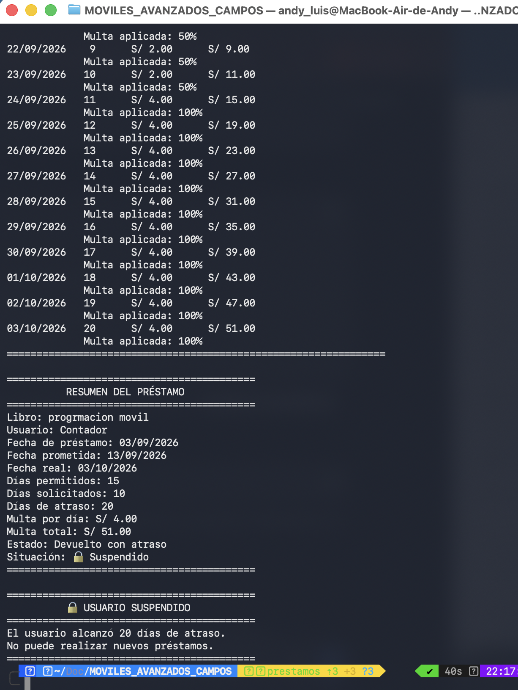

---

## Archivos desarrollados

- `Laboratorio02.swift`
- `PromedioNotas.swift`
- `Prestamos.swift`

## Autor

**Andy Luis Campos Escandón**  
Diseño y Desarrollo de Software  
TECSUP
