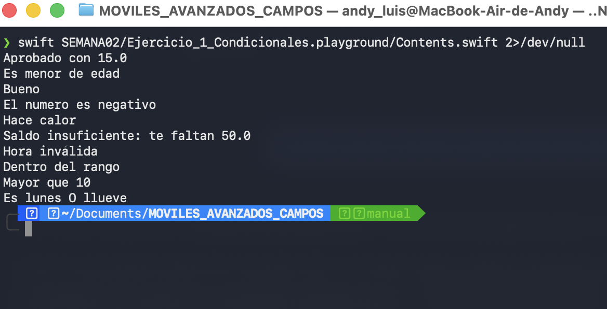
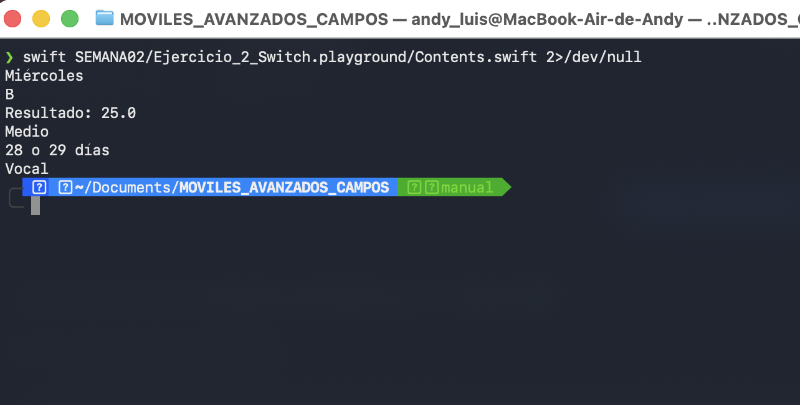
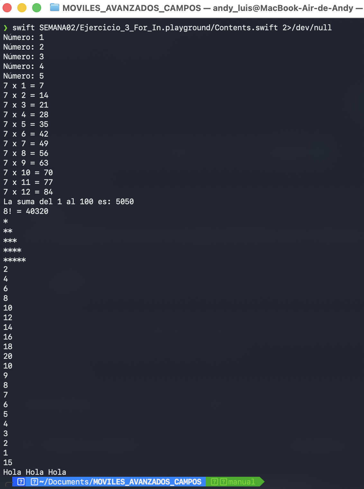
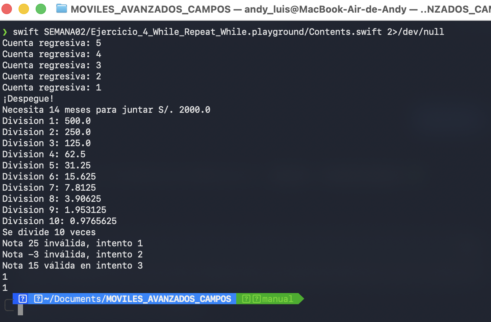
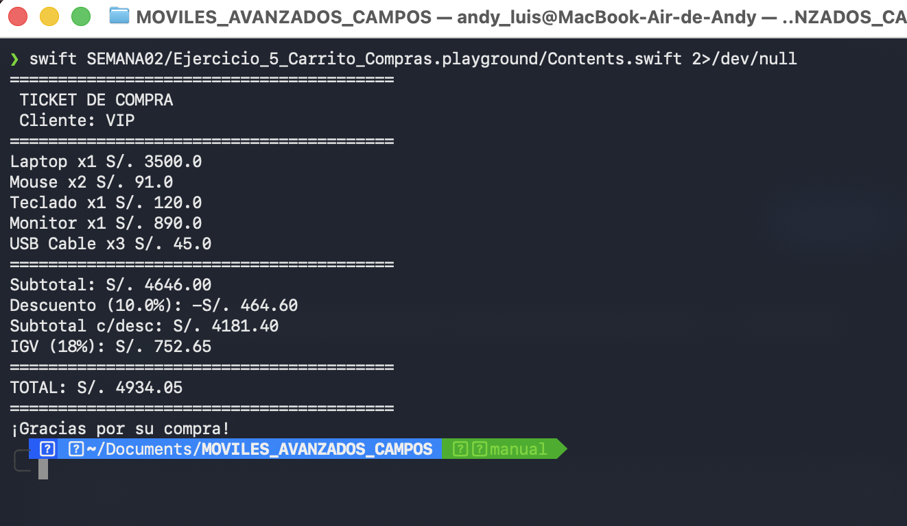

# Laboratorio 02 - Estructuras Condicionales y Bucles

## Programación en Móviles Avanzado

**Estudiante:** Andy Luis Campos Escandón  
**Docente:** Juan León S.  
**Semana:** 03
**Lenguaje:** Swift  
**Entorno:** Xcode - Playground  

---

## Descripción

En este laboratorio se desarrollaron ejercicios en Swift utilizando estructuras condicionales y bucles. Se trabajó con `if`, `else`, `else if`, `switch`, `for-in`, `while` y `repeat-while`.

También se desarrolló un carrito de compras simplificado como ejercicio integrador, aplicando las estructuras trabajadas durante el laboratorio.

---

## Ejercicio 1 - Condicionales

Se utilizaron estructuras `if`, `else` y `else if` para evaluar condiciones, clasificar notas y validar diferentes valores.

### Evidencia

---

## Ejercicio 2 - Switch

Se utilizó `switch` con diferentes casos y rangos para clasificar notas, realizar operaciones matemáticas y determinar categorías de productos.

### Evidencia

---

## Ejercicio 3 - Bucles For-In

Se utilizaron bucles `for-in` para realizar una tabla de multiplicar, una sumatoria, calcular un factorial y generar un patrón de asteriscos.

### Evidencia

---

## Ejercicio 4 - While y Repeat-While

Se utilizaron los bucles `while` y `repeat-while` para realizar una cuenta regresiva, calcular un ahorro mensual, realizar divisiones sucesivas y validar una nota.

### Evidencia

---

## Ejercicio 5 - Carrito de Compras

Se desarrolló un carrito de compras simplificado utilizando condicionales, `switch` y bucles. Se calcularon los subtotales, descuentos, categoría del cliente, IGV y total final.

### Evidencia

---

## Resultado

Se completaron los cinco ejercicios correspondientes a la rama `manual`, aplicando las estructuras condicionales y los diferentes tipos de bucles trabajados durante la Semana 03.
