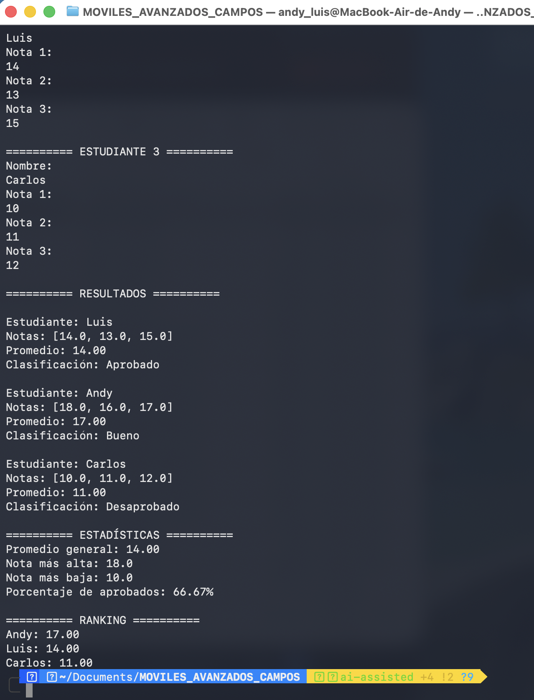
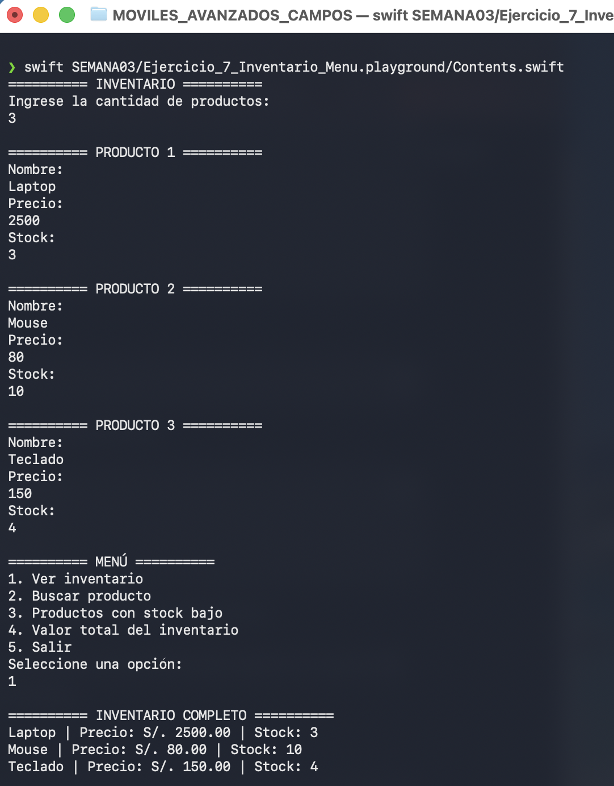
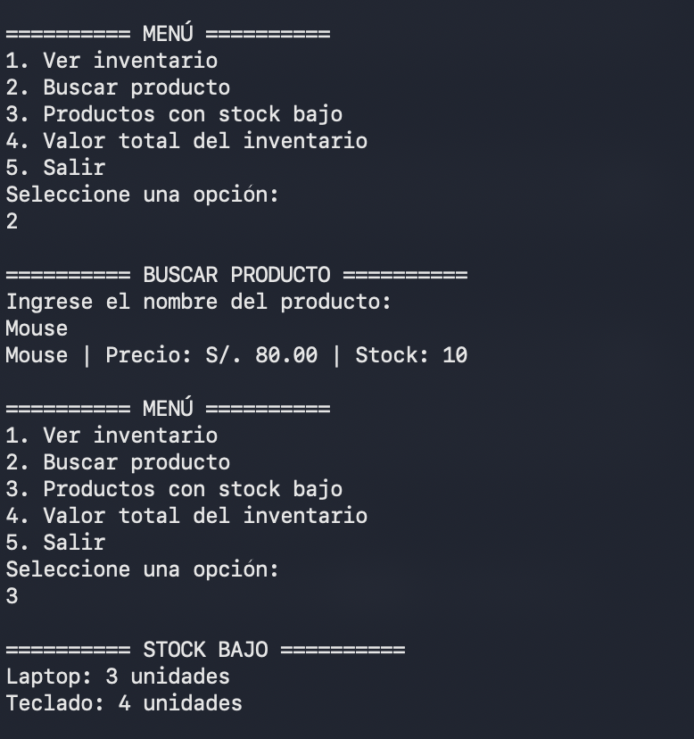
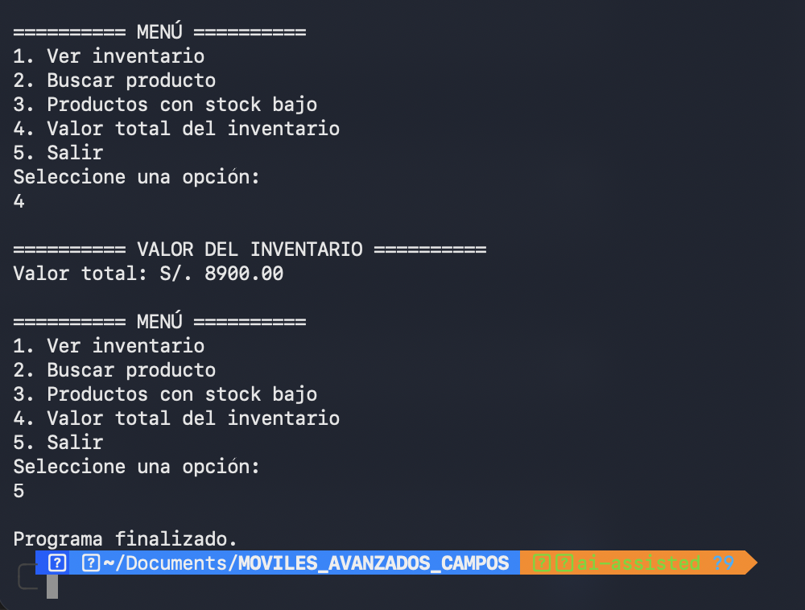

# Laboratorio 03 - Colecciones en Swift

**Curso:** Programación en Móviles Avanzado  
**Semana:** 03  
**Rama:** `ai-assisted`  
**Desarrollado por:** Andy Luis Campos Escandón  

## Descripción

En esta parte del laboratorio desarrollé los ejercicios 6 y 7 utilizando colecciones en Swift con apoyo de inteligencia artificial.

Se trabajó con Arrays, Diccionarios, ciclos, condicionales, `switch`, `while` y entrada de datos mediante `readLine()`. El desarrollo con IA fue documentado mediante prompts organizados con la estructura CTRFE.

---

## Estructura del laboratorio

```text
SEMANA03/
├── Ejercicio_6_Gestion_Notas.playground
├── Ejercicio_7_Inventario_Menu.playground
├── evidencias/
│   ├── ejercicio_6_gestion_notas.png
│   ├── ejercicio_7_inventario_1.png
│   ├── ejercicio_7_inventario_2.png
│   └── ejercicio_7_inventario_3.png
├── PROMPTS.md
└── README.md
```

---

## Ejercicio 6 - Gestión de Notas

En este ejercicio desarrollé un programa para registrar estudiantes junto con tres notas para cada uno utilizando un diccionario.

El programa calcula el promedio individual y utiliza `switch` para clasificar a cada estudiante como **Excelente, Bueno, Aprobado o Desaprobado**.

También obtiene estadísticas generales como el promedio del grupo, la nota más alta, la nota más baja y el porcentaje de aprobados. Finalmente, muestra un ranking ordenado según el promedio.

### Resultado



---

## Ejercicio 7 - Inventario con Menú

En este ejercicio desarrollé un inventario utilizando diccionarios para almacenar los precios y el stock de los productos.

Mediante un ciclo `while` y una estructura `switch`, el programa mantiene activo un menú que permite visualizar el inventario, buscar productos, identificar productos con stock bajo, calcular el valor total y finalizar la ejecución.

### Registro y visualización



### Búsqueda y stock bajo



### Valor total y salida



---

## Desarrollo con IA

Los ejercicios de esta rama fueron desarrollados por etapas con apoyo de **ChatGPT**.

Los prompts utilizados fueron documentados mediante la metodología **CTRFE**, considerando:

- Contexto
- Tarea
- Restricciones
- Formato
- Ejemplo

El detalle completo se encuentra en el archivo [`PROMPTS.md`](./PROMPTS.md).

---

## Cómo ejecutar

Desde la raíz del repositorio se pueden ejecutar los ejercicios mediante:

```bash
swift SEMANA03/Ejercicio_6_Gestion_Notas.playground/Contents.swift
```

```bash
swift SEMANA03/Ejercicio_7_Inventario_Menu.playground/Contents.swift
```

---

Las evidencias de los ejercicios 6 y 7 de la rama `ai-assisted` están completas y documentadas.
