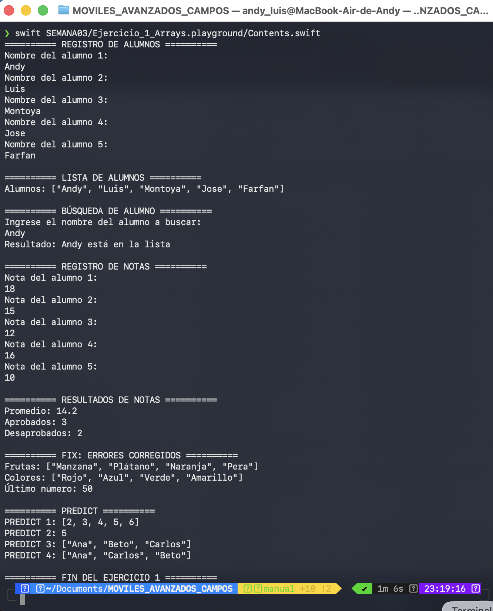
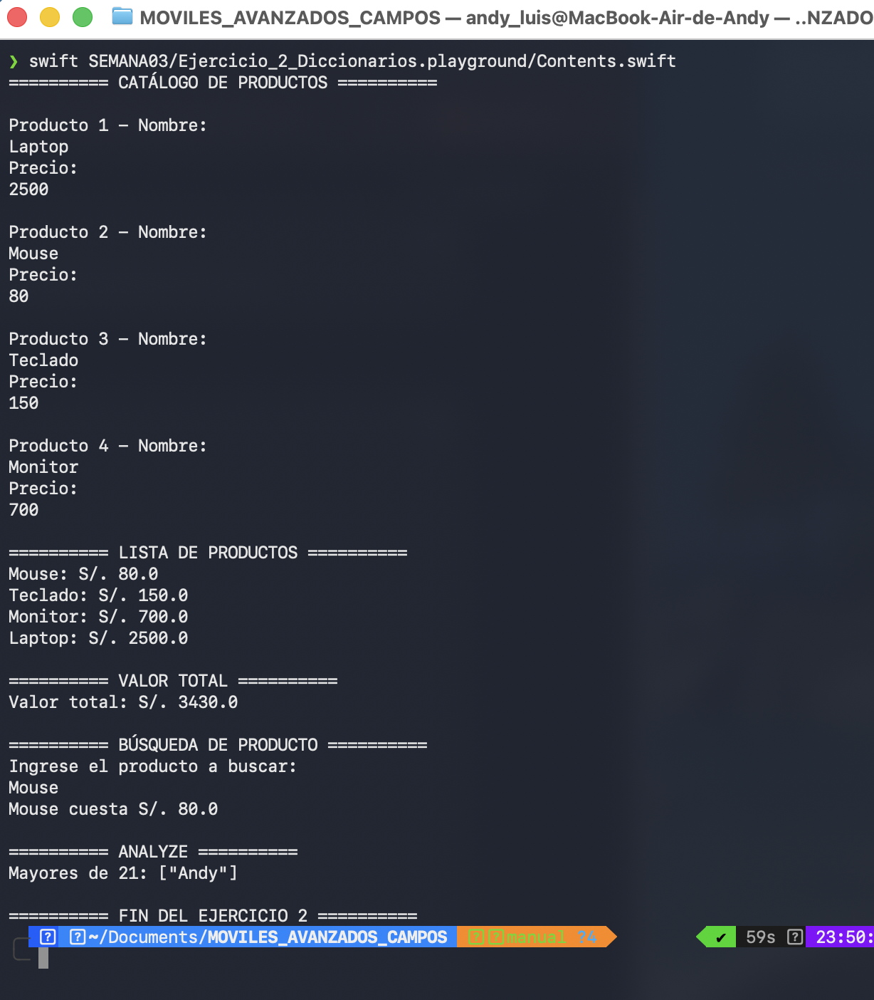
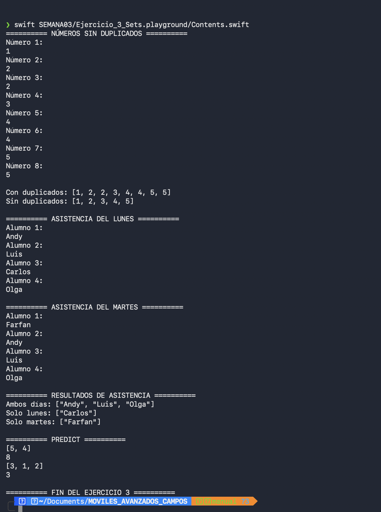
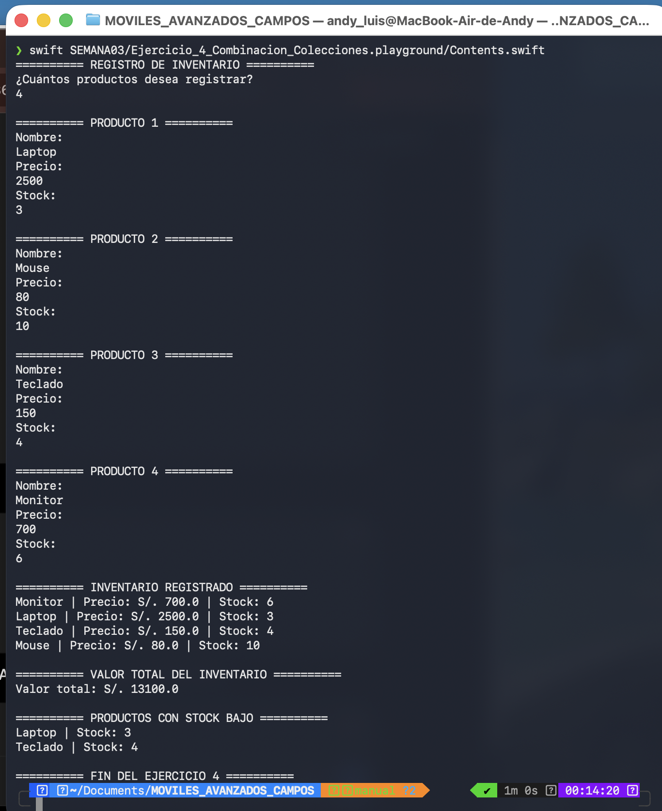
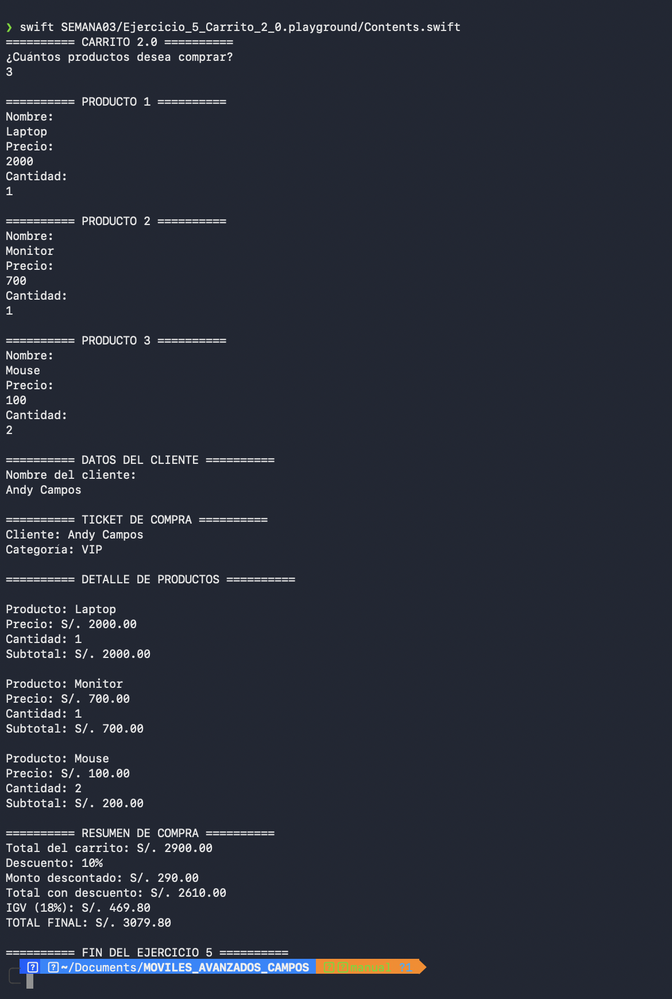

# Laboratorio 03 - Colecciones en Swift

**Curso:** Programación en Móviles Avanzado  
**Semana:** 03  
**Rama:** `manual`  
**Desarrollado por:** Andy Luis Campos Escandón  

## Descripción

En este laboratorio trabajé con las principales colecciones de Swift: **Arrays, Diccionarios y Sets**. A través de cinco ejercicios apliqué estas estructuras junto con ciclos, condicionales y entrada de datos mediante `readLine()`.

El objetivo fue comprender cómo almacenar, recorrer, buscar y procesar diferentes tipos de información utilizando colecciones.

---

## Estructura del laboratorio

```text
SEMANA03/
├── Ejercicio_1_Arrays.playground
├── Ejercicio_2_Diccionarios.playground
├── Ejercicio_3_Sets.playground
├── Ejercicio_4_Combinacion_Colecciones.playground
├── Ejercicio_5_Carrito_2_0.playground
├── evidencias/
│   ├── ejercicio_1_arrays.png
│   ├── ejercicio_2_diccionarios.png
│   ├── ejercicio_3_sets.png
│   ├── ejercicio_4_combinacion_colecciones.png
│   └── ejercicio_5_carrito_2_0.png
└── README.md
```

---

## Ejercicio 1 - Arrays

En este ejercicio utilicé **Arrays** para registrar alumnos y notas. También realicé búsquedas dentro de la colección, calculé el promedio y determiné la cantidad de aprobados y desaprobados.

Además, desarrollé las secciones **FIX** y **PREDICT** propuestas en el laboratorio.



---

## Ejercicio 2 - Diccionarios

Utilicé un **Diccionario** para relacionar el nombre de cada producto con su precio. El programa permite registrar productos, mostrar el catálogo, calcular su valor total y realizar búsquedas utilizando `if let`.

También desarrollé la sección **ANALYZE** para comprender el recorrido y filtrado de datos almacenados en un diccionario.



---

## Ejercicio 3 - Sets

En este ejercicio trabajé con **Sets** para eliminar números duplicados y comparar la asistencia de alumnos entre dos días.

Utilicé operaciones como `intersection` y `subtracting` para identificar alumnos que asistieron ambos días o solamente uno de ellos.



---

## Ejercicio 4 - Combinación de Colecciones

En este ejercicio combiné dos diccionarios para administrar el **precio y stock de productos**.

Con los datos registrados calculé el valor total del inventario e identifiqué los productos que tenían menos de cinco unidades disponibles.



---

## Ejercicio 5 - Carrito 2.0

Desarrollé un carrito de compras utilizando **tres Arrays** para almacenar los nombres, precios y cantidades de los productos.

El programa calcula subtotales, descuentos, IGV del 18% y el total final. También determina la categoría del cliente de acuerdo con el monto original de su compra.



---

## Cómo ejecutar

Los ejercicios pueden ejecutarse desde la raíz del repositorio:

```bash
swift SEMANA03/Ejercicio_1_Arrays.playground/Contents.swift
swift SEMANA03/Ejercicio_2_Diccionarios.playground/Contents.swift
swift SEMANA03/Ejercicio_3_Sets.playground/Contents.swift
swift SEMANA03/Ejercicio_4_Combinacion_Colecciones.playground/Contents.swift
swift SEMANA03/Ejercicio_5_Carrito_2_0.playground/Contents.swift
```

---

Las cinco evidencias de la rama `manual` están completas y documentadas.
