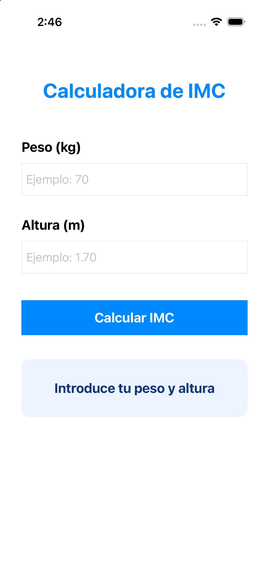
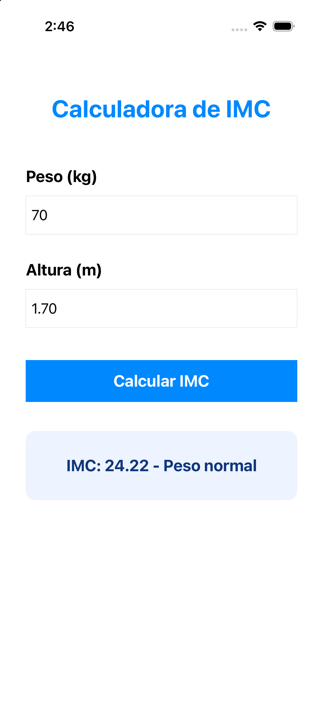

# Semana 05 - Actividad 02: Calculadora de IMC

## Descripción

Aplicación iOS desarrollada con UIKit y Storyboard para calcular el índice de masa corporal de una persona a partir de su peso y altura.

## Requisitos de la guía

- Solicitar el peso en kilogramos.
- Solicitar la altura en metros.
- Calcular el IMC mediante la fórmula `peso / altura²`.
- Mostrar el resultado con dos decimales.
- Informar la clasificación correspondiente.

## Funcionalidad

La aplicación permite ingresar peso y altura, calcular el IMC y mostrar una de estas clasificaciones:

- IMC menor que 18.5: bajo peso.
- IMC desde 18.5 y menor que 25: peso normal.
- IMC desde 25 y menor que 30: sobrepeso.
- IMC desde 30: obesidad.

## Validaciones

- Los dos campos son obligatorios.
- Los valores deben ser numéricos y mayores que cero.
- Se aceptan decimales escritos con punto o coma.
- Cuando existe un dato inválido se muestra un mensaje y no se realiza el cálculo.

## Tecnologías utilizadas

- Swift
- UIKit
- Storyboard
- Auto Layout
- Xcode

## Estructura del proyecto

```text
Semana05_02/
├── Semana05_02.xcodeproj
├── Semana05_02/
│   ├── AppDelegate.swift
│   ├── SceneDelegate.swift
│   ├── ViewController.swift
│   ├── Main.storyboard
│   ├── LaunchScreen.storyboard
│   ├── Info.plist
│   └── Assets.xcassets
├── Evidencias/
└── README.md
```

## Ejecución

Desde la raíz del repositorio, abrir el proyecto con:

```bash
open SEMANA05/Semana05_02/Semana05_02.xcodeproj
```

Luego seleccionar un simulador de iPhone y presionar `Command + R`.

## Evidencias

### Formulario de la calculadora



### Resultado del cálculo



## Rama de desarrollo

```text
manual
```

## Autor

**Andy Luis Campos Escandón**
