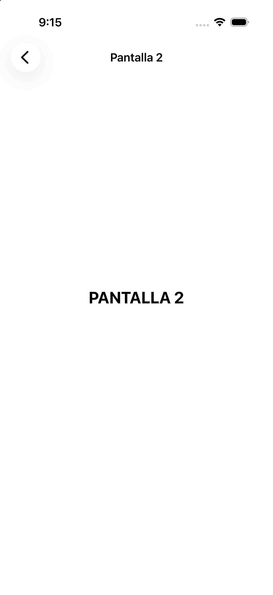
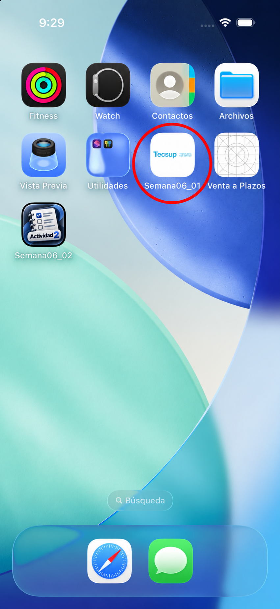

# Evidencias - Semana06_01

## Navegación entre pantallas

La aplicación inicia en **Pantalla 1** dentro de un `UINavigationController` y presenta el botón **A Pantalla 2** para ejecutar el segue `Show`.

## Pantalla 2

La segunda pantalla confirma que el `segue` de tipo `Show` realizó correctamente la navegación dentro del `UINavigationController`.

## Icono de la aplicación

La aplicación **Semana06_01** utiliza el icono de TECSUP solicitado en la actividad. El círculo rojo permite identificarlo claramente en el simulador.

