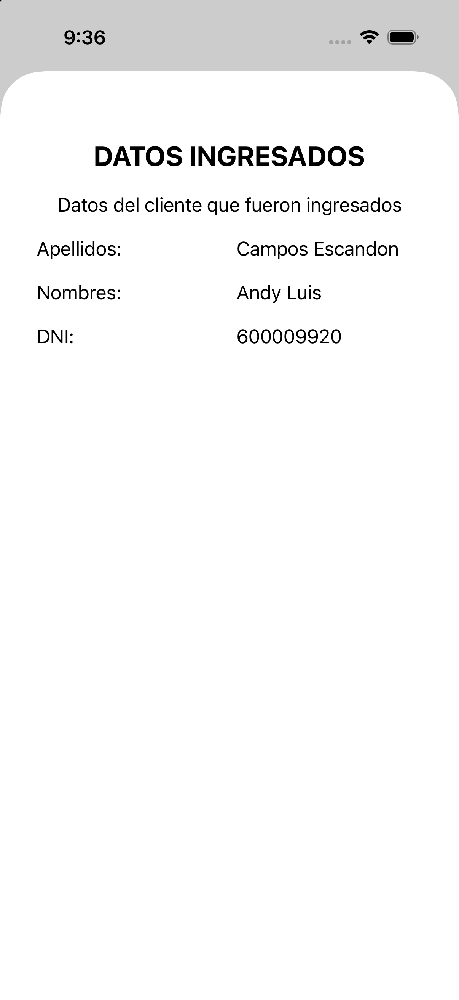
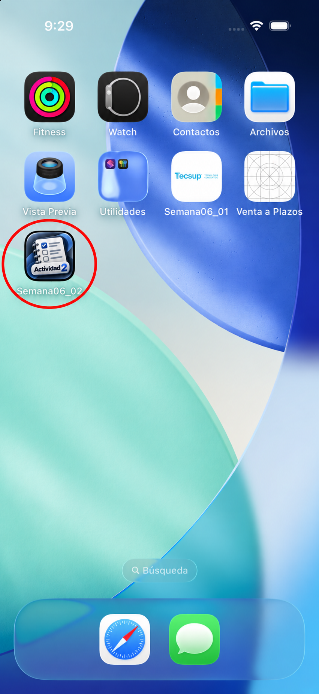

# Evidencias - Semana06_02

## Registro de cliente

La pantalla solicita apellidos, nombres y DNI. El botón **Continuar** crea un `ClienteModel` y presenta de forma modal la pantalla de confirmación.

## Datos ingresados

La pantalla de confirmación muestra los apellidos, nombres y DNI enviados desde el formulario mediante el modelo del cliente.

## Icono de la aplicación

La aplicación **Semana06_02** utiliza el icono de Actividad 2. El círculo rojo permite identificarla claramente en el simulador.

