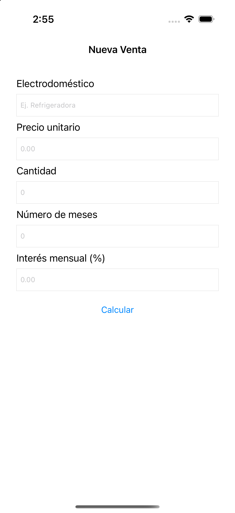
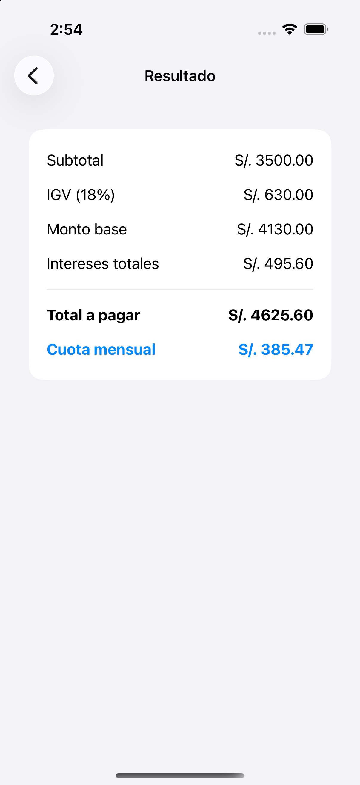

# Evidencias - Semana06_Tarea

## Nueva venta

La aplicación solicita el electrodoméstico, precio unitario, cantidad, número de meses y tasa de interés mensual.

## Resultado

La segunda pantalla presenta subtotal, IGV, monto base, intereses, total y cuota mensual con formato en soles.

